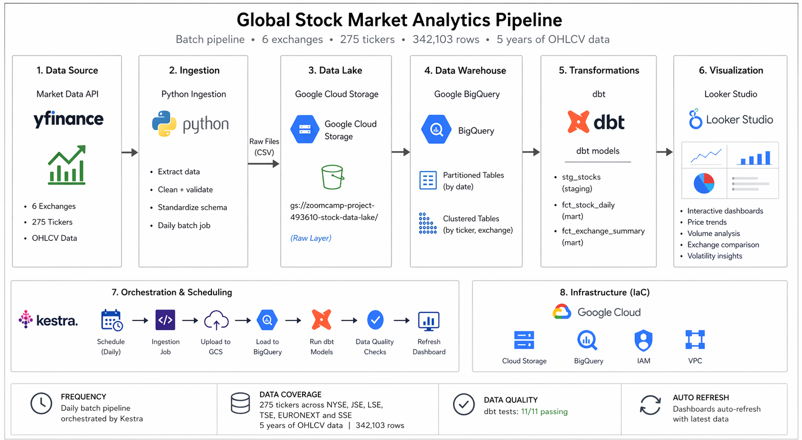
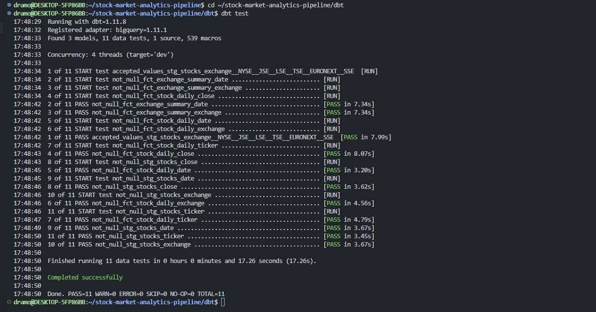
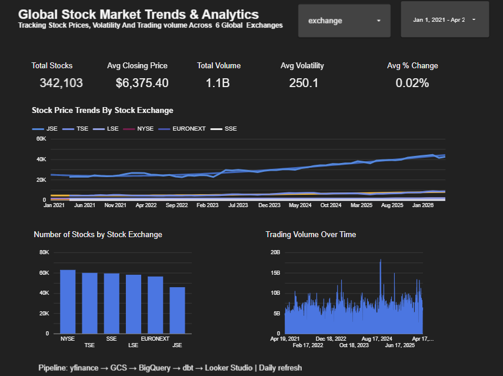
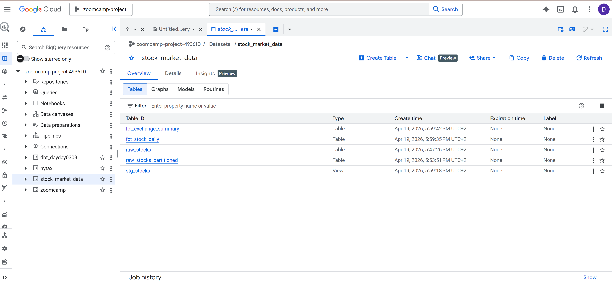
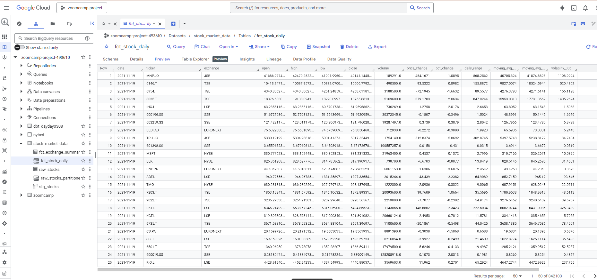

# Global Stock Market Analytics Pipeline

> Production-grade, end-to-end data pipeline for global stock market analytics across 6 stock exchanges, enabling cross-market insights using GCP, Terraform, Kestra, BigQuery, and dbt.


## Overview

This project builds a production-style batch data pipeline that ingests and transforms global stock market data into analytics-ready datasets, enabling cross-exchange comparison of price trends, volatility, and trading activity across 6 major global exchanges.

The pipeline simulates a real-world data platform used by analysts and investors to monitor market trends, compare exchange performance, and track stock behavior over time.

## Business Problem

Financial market data is highly fragmented and difficult to analyze across different exchanges. Investors and analysts often struggle to:

- Compare stock performance across global markets
- Identify trends and volatility patterns
- Access clean, structured historical data for analysis

This project addresses these challenges by building a centralized analytics platform that provides cross-exchange performance comparison, trend analysis using moving averages, and volatility and price change insights.

## Architecture



yfinance API → Python Ingestion → GCS Data Lake → BigQuery Data Warehouse → dbt Transformations → Looker Studio Dashboard

- Data is ingested daily via the yfinance API as CSV files
- Raw data is stored in Google Cloud Storage (GCS) as the data lake
- Data is loaded into BigQuery, partitioned by date and clustered by exchange and ticker
- Transformations are handled using dbt to produce analytics-ready tables
- Insights are visualized in Looker Studio

## Pipeline Flow

1. Extract stock data from yfinance API for 275 companies across 6 exchanges
2. Store raw CSV files in GCS (data lake)
3. Load raw data into BigQuery raw layer
4. Transform data using dbt into analytics-ready models
5. Visualize insights in Looker Studio dashboard

## Tech Stack

| Tool | Purpose |
|------|---------|
| Google Cloud Platform | Cloud infrastructure |
| Terraform | Infrastructure as Code |
| Kestra | Pipeline orchestration |
| Google Cloud Storage | Data lake (raw CSV files) |
| BigQuery | Data warehouse (partitioned and clustered) |
| dbt | Data transformations and testing |
| Looker Studio | Interactive dashboard |
| Python 3.12 | Data ingestion scripts |

## Why This Stack?

- BigQuery: Serverless scalable analytics warehouse with partitioning and clustering for cost-efficient querying
- dbt: Modular SQL transformations with built-in testing and clear staging/core separation
- GCS: Cost-effective object storage for raw CSV files as the data lake layer
- Kestra: Lightweight orchestration with simple YAML-based pipeline definitions
- Terraform: Reproducible infrastructure provisioning ensuring consistent environments

## Dataset

- Exchanges: NYSE (USA), JSE (South Africa), LSE (UK), TSE (Japan), EURONEXT (Europe), SSE (China)
- Stocks: 275 tickers (representing individual publicly traded companies) across 6 global exchanges
- Time Range: 2021–Present (~5 years of daily price data)
- Volume: 342,103 rows of daily stock records
- Data Fields: date, ticker, exchange, open, high, low, close, volume

> A **ticker** is a short symbol identifying a company stock (e.g. AAPL = Apple, MSFT = Microsoft, NPN_JO = Naspers on JSE). Each row represents a single company's trading data for one day, containing the Opening price, Highest price, Lowest price, Closing price and trading Volume.

## Key Features

- Automated daily batch pipeline using Kestra
- Scalable cloud-native architecture on GCP
- Optimized BigQuery tables with date partitioning and exchange/ticker clustering
- Modular dbt transformation layer with staging and core models
- Cross-exchange analytics for global market comparison
- Fully reproducible pipeline with infrastructure as code

## Analytics Outputs

- Daily price change and percentage returns per stock
- 7-day and 30-day moving averages per ticker
- 30-day rolling volatility per ticker
- Exchange-level aggregated metrics (average closing price, total volume, average volatility)
- Cross-exchange performance comparison across NYSE, JSE, LSE, TSE, EURONEXT and SSE

## dbt Models

### Staging Layer

- **stg_stocks**: Cleans raw data, standardizes data types, and prepares data for transformation

### Core Layer

- **fct_stock_daily**: Daily stock metrics including price change, percentage change, 7-day moving average, 30-day moving average, and 30-day volatility. Partitioned by date and clustered by exchange and ticker.
- **fct_exchange_summary**: Aggregated daily metrics per exchange including average closing price, total trading volume, and average volatility.

## Data Quality

dbt tests ensure data integrity across all models:

- Non-null values for all key fields (date, ticker, exchange, close)
- Valid exchange values limited to NYSE, JSE, LSE, TSE, EURONEXT and SSE
- Non-null closing prices across all fact tables
- **11/11 tests passing with zero failures or warnings**



## Dashboard



The Looker Studio dashboard provides:

1. **KPI Cards** — Total Records (342,103), Number of Stocks (275), Average Closing Price, Total Volume, Average Volatility, Average % Change
2. **Stock Price Trends by Exchange** — average closing price trends over time across all 6 exchanges (temporal)
3. **Number of Stocks by Stock Exchange** — distribution of tracked companies per exchange (categorical)
4. **Trading Volume Over Time** — total trading activity and market liquidity trends

Dashboard link: https://datastudio.google.com/reporting/b9c352e2-bc5b-4a1f-a861-37da87382c01

## BigQuery Data Warehouse



All tables are stored in the `stock_market_data` dataset in BigQuery:

- `raw_stocks` — raw ingested data from GCS
- `raw_stocks_partitioned` — partitioned by date, clustered by exchange and ticker
- `stg_stocks` — dbt staging view
- `fct_stock_daily` — daily stock metrics fact table
- `fct_exchange_summary` — exchange level aggregations

### Data Preview (fct_stock_daily)



## Sample Query

```sql
SELECT 
  exchange,
  AVG(close) AS avg_closing_price,
  AVG(volatility_30d) AS avg_volatility,
  SUM(volume) AS total_volume
FROM `zoomcamp-project-493610.stock_market_data.fct_stock_daily`
GROUP BY exchange
ORDER BY avg_closing_price DESC;
```

## Orchestration

The pipeline runs daily at 1 AM using scheduled triggers in Kestra and supports safe re-execution through idempotent design.

Workflow steps:
1. **ingest_stock_data** — fetches data from yfinance and uploads raw CSV files to GCS
2. **load_to_bigquery** — loads data from GCS into BigQuery

Pipeline definition: `kestra/pipeline.yml`

## Setup and Reproduction

### Prerequisites

- GCP account with billing enabled
- Python 3.12+
- Terraform installed
- dbt-bigquery installed

### Step 1 - Clone the repository

```bash
git clone https://github.com/DayDay0308/stock-market-analytics-pipeline.git
cd stock-market-analytics-pipeline
```

### Step 2 - Set up GCP credentials

- Create a GCP project
- Go to IAM and Admin > Service Accounts
- Create a service account with Editor role
- Download the JSON key
- Save it as `credentials.json` in the project root

### Step 3 - Provision infrastructure with Terraform

```bash
cd terraform
terraform init
terraform apply
```

This creates a GCS bucket for the data lake and a BigQuery dataset for the data warehouse.

### Step 4 - Install Python dependencies

```bash
pip3 install yfinance google-cloud-storage google-cloud-bigquery pandas db-dtypes pyarrow
```

### Step 5 - Run data ingestion

```bash
python3 ingestion/ingest_stocks.py
```

This fetches 5 years of daily price data for 275 stocks across 6 exchanges and uploads CSV files to GCS.
Expected output: CSV files appearing in GCS under `raw/stocks/YYYY-MM-DD/`

### Step 6 - Load data into BigQuery

```bash
python3 ingestion/load_to_bigquery.py
```

This loads all CSV files from GCS into a partitioned and clustered BigQuery table.
Expected output: `raw_stocks` table populated in BigQuery with 342,103 rows.

### Step 7 - Run dbt transformations

```bash
cd dbt
dbt run
dbt test
```

Expected output: `stg_stocks`, `fct_stock_daily`, and `fct_exchange_summary` tables in BigQuery with all 11 tests passing.

### Step 8 - View the dashboard

The Looker Studio dashboard is accessible at:
https://datastudio.google.com/reporting/b9c352e2-bc5b-4a1f-a861-37da87382c01

## Results

- Ingested and processed 342,103 rows of real financial data across 6 global exchanges
- Built a scalable pipeline covering 275 companies over 5 years of daily price history
- Reduced raw data complexity into 3 clean analytics-ready dbt models
- Enabled cross-market comparison of price trends, volatility and trading volume
- Achieved 100% data quality test pass rate (11/11 dbt tests passing)

## Challenges and Learnings

- Handling inconsistent ticker formats across 6 different exchanges
- Some tickers are delisted and not available on yfinance — pipeline handles these gracefully
- Optimizing BigQuery cost using date partitioning and exchange/ticker clustering
- Designing dbt models with a clear staging and core separation for reusability
- Managing timezone differences in stock market data across global exchanges
- Resolving BigQuery partition quota limits by switching to single-batch loading

## Future Improvements

- Switch from batch to streaming ingestion using Kafka
- Add more financial indicators such as RSI and MACD
- Use Parquet instead of CSV for better performance and storage efficiency
- Implement CI/CD for dbt models using GitHub Actions
- Add alerting for pipeline failures

## Project Structure

```
stock-market-analytics-pipeline/
├── terraform/          — Infrastructure as Code (GCS bucket and BigQuery dataset)
├── ingestion/          — Python ingestion and loading scripts
├── kestra/             — Kestra orchestration pipeline definition
├── dbt/                — dbt transformations
│   └── models/
│       ├── staging/    — Raw data cleaning and typing
│       └── core/       — Business logic and analytical models
├── images/             — Dashboard and architecture screenshots
├── docker-compose.yml  — Kestra local setup reference
├── .env.example        — Environment variables template
└── README.md           — Project documentation
```